<h1>#repo01</h1>
□ 1.1 - 1.1 – Crea un directorio llamado repo01 en local (desde tu máquina) e ejecuta el comando
pertinente para que dicho directorio para que se transforme el repositorio en local ¿Cómo podemos identificar que el repositorio se ha inicializado?

**Creo el directorio:**
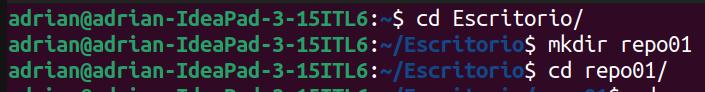

**Inicio el repositorio en dicho directorio:**
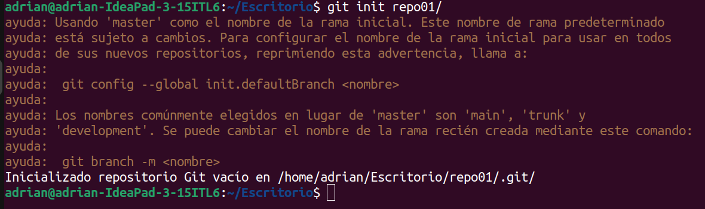

**Identificaremos que el repositorio se ha inicializado porque, una vez inicializado, en nuestro directorio se creará una carpeta .git**

□ 1.2 – Añade un documento llamado readme.md dentro del repositorio (recuerda que MD es la
extensión de los ficheros Markdown) y documenta en su interior todos los pasos que vas realizando para
crear un repositorio, etc. Puedes añadir fotos o lo que creas conveniente

**Creo el archivo .md**
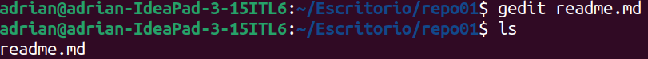

**Creo un repositorio en GitHub:**
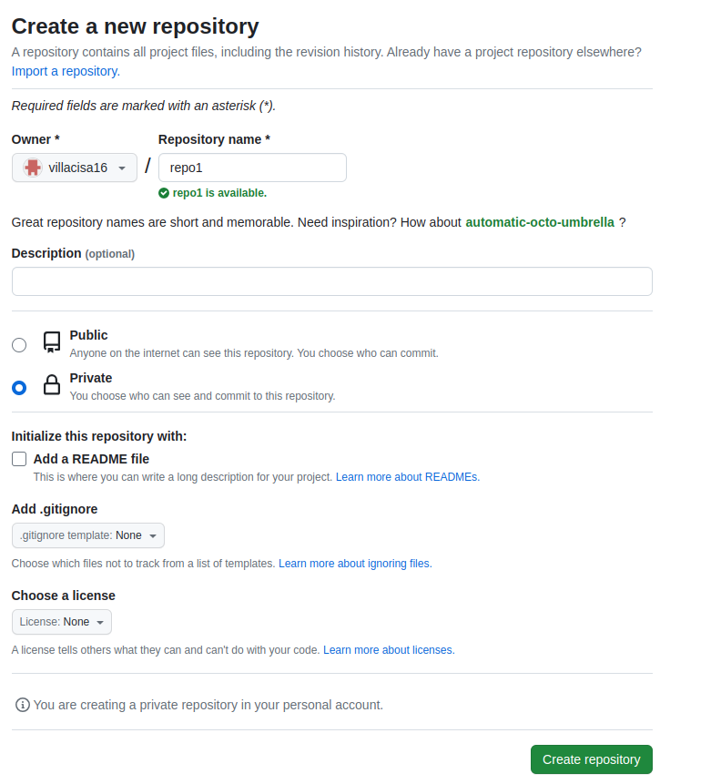

**Hago los siguientes pasos para referenciar mi repositorio local al de la nube:**
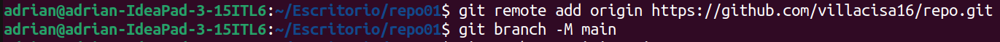

□ 1.3 - Añade el fichero que acabamos de añadir al repositorio al staging area, visualiza el estado del
repositorio (con git status) y haz un snapshot (commit) del fichero hacía nuestro repositorio local. ¿En
que “file status lifecycle” se encuentra el fichero?

**El archivo antes de ser subido se encuentra en estado modificado**
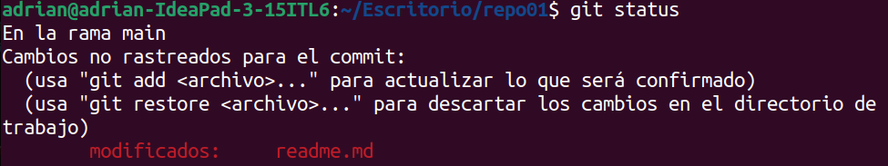

**Una vez modificado este archivo md y creada la carpeta img para adjuntarle las imágenes, procedemos a hacer 'git add' y 'git  commit':**

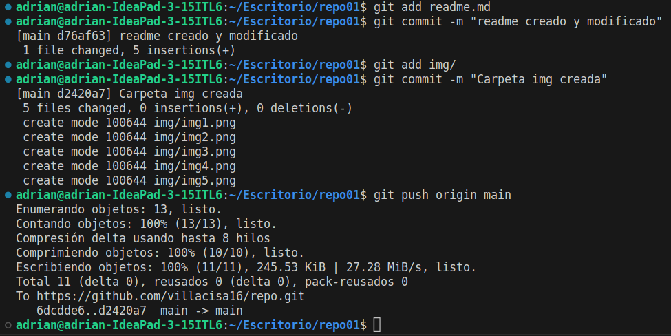

1.4 – Intenta subir los ficheros al repositorio remoto mediante al comando git push ¿Se te ocurre que está pasando? (si no lo sabes aún no te preocupes)

**Hago push**
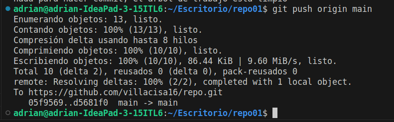

**Con el push se han subido los cambios al repositorio remoto**

**Para poder hacer el push correctamente debe estar creado un repositorio remoto y estar referenciado.**

□ 1.5 – Ejecuta el comando git remote –v e investiga porque no nos aparece nada.

**A mi me aparece la información del repositorio remoto al que está referenciado. Si no me hubiese aparecido nada sería porque no tendría ningún repositorio remoto referencciado y habría que crearlo y referenciarlo**

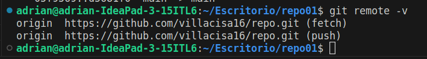

□ 1.6 – Crea un repositorio remoto llamado repo01, asócialo a tu repositorio local.

**Realizado en tarea 1.2**

□ 1.7 – Vuelve a ejecutar el comando git remote –v nuevamente y explica el porque ahora si que aparece

**Aparece información porque ya hay un repositorio remoto referenciado**

□ 1.8 – Sube los cambios que hemos subido al snapshot local (commit) hacía al repositorio remoto.

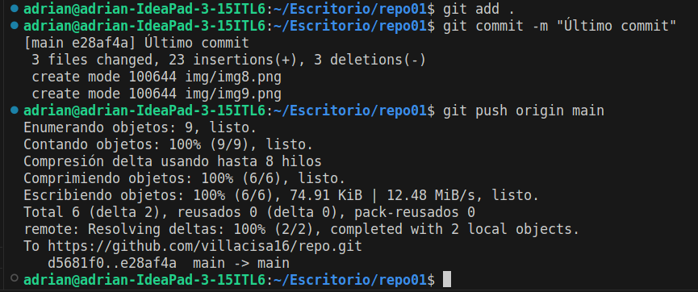

□ 1.9 – Ves al repositorio remoto (en este caso GitHub) y comprueba que se haya realizado el commit correctamente y observa que pasa en el repositorio ¿Observas algo peculiar?

**Los cambios se han subido correctamente con los cambios y el mensaje del commit.**
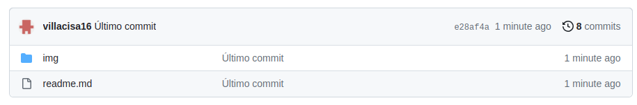