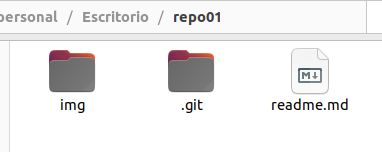

<h1>#repo01</h1>
□ 1.1 - 1.1 – Crea un directorio llamado repo01 en local (desde tu máquina) e ejecuta el comando
pertinente para que dicho directorio para que se transforme el repositorio en local ¿Cómo podemos
identificar que el repositorio se ha inicializado?

**Creo el directorio:**

**Inicio el repositorio en dicho directorio:**

**Identificaremos que el repositorio se ha inicializado porque, una vez inicializado, en nuestro directorio se creará una carpeta .git**

□ 1.2 – Añade un documento llamado readme.md dentro del repositorio (recuerda que MD es la
extensión de los ficheros Markdown) y documenta en su interior todos los pasos que vas realizando para
crear un repositorio, etc. Puedes añadir fotos o lo que creas conveniente

**Creo el archivo .md**

□ 1.3 - Añade el fichero que acabamos de añadir al repositorio al staging area, visualiza el estado del
repositorio (con git status) y haz un snapshot (commit) del fichero hacía nuestro repositorio local. ¿En
que “file status lifecycle” se encuentra el fichero?

**Una vez modificado este archivo md y creada la carpeta img para adjuntarle las imágenes, procedemos a hacer 'git add' y 'git  commit':**

□ 1.4 - Crea un repositorio remoto llamado repo01, asócialo a tu repositorio local y
sube los cambios al repositorio remoto
**Creo un repositoorio en GitHub:**

**Hago los siguientes pasos para referenciar mi repositorio local al de la nube:**

**Hago push de los cambios (hechos anteriormente en el paso 1.3)**

